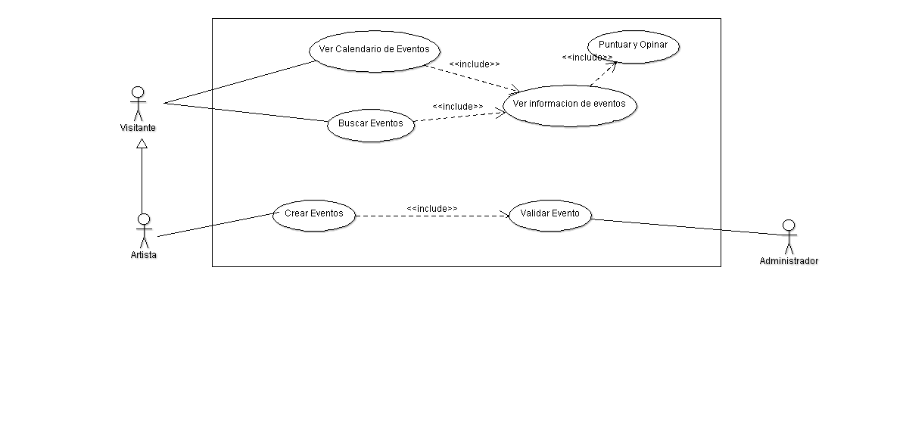
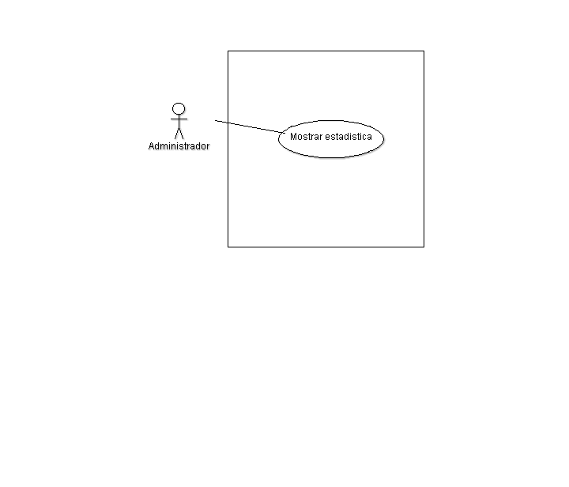

**Diseño de la aplicación**
===========================

**Casos de Uso General**
------------------------

.. figure:: _static/Diagramadecasodeuso.png
   :align:  center

**Acceso**
----------

.. figure:: _static/Acceso.png
   :align:  center

**Administracion**
------------------

.. figure:: _static/Administracion.png
   :align:  center

**Artista**
-----------

.. figure:: _static/Artista.png
   :align:  center

**Capsulas informativas**
-------------------------

.. figure:: _static/Capsulas.png
   :align:  center

**Eventos**
-------------------------

**Calendario**
-------------------------

.. figure:: _static/Calendario.png
   :align:  center

**Estadisticas**
-------------------------

**Clases**
==========

**Diagrama de BD**
==================

